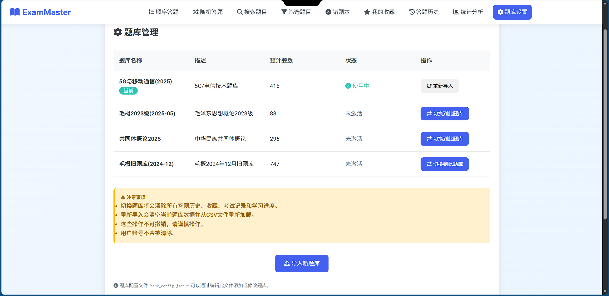

# EXAM-MASTER


一款基于 **Flask** 的在线刷题系统，支持 **Web 端** 和 **Android 端**。提供题库管理、多模式答题、统计分析、CSV 导入导出等完整功能。

---

## 🌟 功能特性

### 📚 题库管理
- **多题库切换**: 内置 4 套题库，一键切换（清除旧数据 + 自动导入）
- **外部 CSV 导入**: Web 端上传 CSV 文件，Android 端从文件选择器导入，自动验证格式
- **题库配置**: `bank_config.json` 统一管理所有题库，支持动态添加
- **多种题型**: 单选题、多选题、判断题（自动注入正确/错误选项）

### 📋 答题模式
- **随机答题**: 从题库随机抽取未完成的题目
- **顺序答题**: 从上次位置继续，自动记忆进度（Web + Android 双向同步）
- **错题练习**: 专门复习答错的题目
- **收藏题目**: 将重要题目加入收藏夹

### 🔄 答题体验
- **上一题回顾**: 支持回看本次已答的所有题目，游标式前后导航，只读模式显示用户答案和正确答案
- **提交后保留选择**: 提交答案后选项保持选中状态，方便查看自己的选择
- **正确/错误标记**: 正确答案绿色边框，错误选择红色边框，一目了然
- **位置记忆**: 跨会话记住最后浏览位置，下次打开继续

### 📊 统计与分析
- 答题进度跟踪（已答/总数/正确率）
- 错题排行、分类统计
- 完整答题历史记录

### 📱 Android 端特性
- Material Design 3 原生 UI
- 离线优先，全部数据本地存储
- 垂直滚动答题页面
- 单选/多选/判断题交互优化

---

## 💻 技术栈

| 层 | Web 端 | Android 端 |
|---|--------|-----------|
| 语言 | Python 3 | Kotlin |
| 框架 | Flask | Jetpack Compose |
| 数据库 | SQLite | Room (SQLite) |
| 架构 | Server-rendered (Jinja2) | MVVM + Repository |
| UI | Bootstrap + 自定义 CSS | Material Design 3 |

---

## 🚀 快速开始

### Web 端

```bash
git clone https://github.com/letsdance9527/EXAM-MASTER-plus.git
cd EXAM-MASTER-plus
pip install -r requirements.txt
python app.py
# 访问 http://localhost:32220
```

### Android 端

```bash
cd ExamMasterAndroid
# 用 Android Studio 打开，或命令行构建：
./gradlew assembleDebug
# APK 位于 app/build/outputs/apk/debug/
```

---

## 📖 使用指南

### 题库管理

1. 点击导航栏「题库设置」→ 查看所有可用题库
2. 点击「切换到此题库」→ 确认清空 → 自动导入新题库
3. 点击「导入新题库」→ 输入名称 + 选择 CSV → 提交
4. 点击「重新导入」→ 刷新当前题库数据

### CSV 格式要求

```
题号,题干,A,B,C,D,E,答案,难度,题型
1,5G的服务对象仍然仅以人为中心。,,,,,,错误,无,判断题
2,LTE系统的多址方式是____。,TDMA,CDMA,OFDMA,FDMA,,C,无,单选题
```

| 列名 | 必填 | 说明 |
|------|------|------|
| 题号 | ✅ | 唯一标识，数字 |
| 题干 | ✅ | 题目内容 |
| A~E | 可选 | 选项文本（判断题留空） |
| 答案 | ✅ | 单选: `A`；多选: `AB`；判断: `正确`/`错误` |
| 难度 | 可选 | 如 `无`、`易`、`中`、`难` |
| 题型 | ✅ | `单选题` / `多选题` / `判断题` |
| 类别 | 可选 | 如 `移动通信` |

> **编码**: UTF-8（推荐带 BOM 的 UTF-8-SIG）

### 答题流程

1. **首页** → 选择答题模式
2. **答题页** → 选择答案 → 提交 → 查看结果
3. **上一题** → 点击按钮回看本次已答题目（只读模式，显示正确/错误标记）
4. **继续答题** → 进入下一题

### 顺序答题位置记忆

- 系统自动保存当前浏览位置
- 退出后重新进入「顺序答题」→ 从上次位置继续
- 首页显示「顺序答题将从第 X 题继续」提示
- 重置历史时清除位置

---

## 🔄 最近更新

### v3.1 — 功能完整版 (2025-06)

**Web 端新增：**
- 🗂 **多题库切换**: 题库管理页面，一键切换 4 套题库
- 📤 **外部 CSV 导入**: 上传 CSV 文件自动验证格式并注册
- ↩️ **上一题回顾**: 游标式历史导航，回看本次所有已答题
- ✅ **判断题支持**: 自动注入正确/错误选项
- 🎨 **UI 优化**: 正确/错误答案颜色区分，选择状态保留
- 📍 **位置记忆强化**: 所有模式共享浏览位置
- 🔧 **格式说明常驻**: 修复 5 秒消失 Bug

**Android 端新增：**
- 🗂 **多题库切换**: 首页题库选择对话框
- 📤 **外部 CSV 导入**: 文件选择器 + 格式验证 + 错误提示
- ↩️ **上一题回顾**: 游标式历史导航
- ✅ **判断题支持**: 选项注入 + 单选行为 + 答案比较修复
- 📍 **位置记忆**: SharedPreferences 持久化
- 🔄 **错题练习**: 随机抽取未完成的错题
- 🗑 **清除数据**: 设置页确认对话框
- 📜 **垂直滚动**: 修复长题目底部按钮被裁切
- 🎨 **选项对错着色**: 提交后绿色/红色边框

---

## 📁 项目结构

```
EXAM-MASTER/
├── app.py                  # Flask 主应用
├── bank_manager.py         # 题库管理模块
├── bank_config.json        # 题库配置文件
├── requirements.txt        # Python 依赖
├── static/style.css        # 全局样式
├── templates/              # Jinja2 模板
│   ├── base.html           # 基础布局
│   ├── index.html          # 首页
│   ├── question.html       # 答题页
│   ├── manage_banks.html   # 题库管理
│   ├── import_bank.html    # CSV 导入
│   └── ...
├── tools/                  # CSV 题库 + 转换脚本
│   ├── questions.csv       # 毛概题库 (881题)
│   ├── questions_202505共同体概论.csv
│   ├── questions_old_202412.csv
│   └── convert_txt_csv.py
├── 移动通信_题库导出.csv    # 5G移动通信题库 (415题)
└── ExamMasterAndroid/      # Android 应用
    └── app/src/main/
        ├── assets/         # 内置题库 + banks.json
        └── kotlin/com/exammaster/
            ├── data/       # 数据层 (实体/DAO/仓库)
            └── ui/         # UI 层 (页面/ViewModel)
```

---

## 📊 项目截图

### Web 端

| 首页 | 答题页 |
|------|--------|
|  |  |

| 题库管理 | CSV 导入 |
|----------|----------|
|  |  |

> 💡 更多截图（Android 端、回顾模式等）可补充到 `screenshots/` 目录

---

## 🛠 开发者

- **作者**: ShayneChen
- **联系方式**: [xinyu-c@outlook.com](mailto:xinyu-c@outlook.com)
- **项目主页**: [GitHub](https://github.com/letsdance9527/EXAM-MASTER-plus)

## 📄 许可证

MIT License

---

欢迎提交 Issue 或 Pull Request！
